# ai-commit

<div align="center">


[](https://goreportcard.com/report/github.com/in-jun/ai-commit)

> 🤖 AI 기반 git 커밋 메시지 생성 도구

</div>

---

## 📋 목차

-   [Features](#-features)
-   [Getting Started](#-getting-started)
    -   [Prerequisites](#prerequisites)
    -   [Installation](#installation)
    -   [API Key Setup](#api-key-setup)
-   [Usage](#-usage)
    -   [Quick Start](#quick-start)
    -   [Examples](#examples)
    -   [Configuration](#configuration)
    -   [Commands](#commands)
-   [Advanced](#-advanced)
    -   [Best Practices](#best-practices)
    -   [Templates](#templates)
    -   [Customization](#customization)
-   [Troubleshooting](#-troubleshooting)
-   [FAQs](#-faqs)

---

## ✨ Features

ai-commit은 Gemini AI를 활용하여 git 커밋 메시지를 자동으로 생성하는 CLI 도구입니다.

### 핵심 기능

-   🎯 **스마트 분석**

    -   스테이징된 변경사항 자동 분석
    -   프로젝트 컨텍스트 이해
    -   이전 커밋 스타일 학습

-   🤖 **AI 기반 생성**

    -   Conventional Commits 형식 준수
    -   멀티 라인 설명 자동 생성
    -   변경 사항에 대한 상세한 설명

-   ✏️ **메시지 편집**

    -   생성된 메시지 검토 및 수정
    -   선호하는 텍스트 에디터 사용
    -   커밋 전 완벽한 메시지 조정

-   📝 **커스터마이징**

    -   템플릿 기반 커밋 타입
    -   다국어 지원
    -   설정 가능한 옵션들

-   ⚡️ **개발자 경험**
    -   간단한 CLI 인터페이스
    -   빠른 설치와 설정
    -   직관적인 사용법

---

## 🚀 Getting Started

### Prerequisites

시작하기 전에 다음 요구사항을 확인하세요:

| 요구사항      | 최소 버전 | 설치 방법                              |
| ------------- | --------- | -------------------------------------- |
| Go            | 1.21+     | [공식 사이트](https://go.dev/dl/)      |
| Git           | 2.0+      | `apt install git` / `brew install git` |
| Gemini API 키 | -         | [발급 방법](#api-key-setup)            |

### Installation

**Linux/Ubuntu**

```bash
# 1. Go 설치
sudo apt install golang-go

# 2. PATH 설정
echo 'export PATH=$PATH:~/go/bin' >> ~/.bashrc
source ~/.bashrc

# 3. ai-commit 설치
go install github.com/in-jun/ai-commit@latest
```

**macOS**

```bash
# 1. Go 설치
brew install go

# 2. PATH 설정
echo 'export PATH=$PATH:~/go/bin' >> ~/.zshrc
source ~/.zshrc

# 3. ai-commit 설치
go install github.com/in-jun/ai-commit
```

### API Key Setup

1. [Google AI Studio](https://aistudio.google.com/app/apikey) 접속
2. Google 계정으로 로그인
3. 'API 키 관리' → '새 API 키 만들기' 클릭
4. 생성된 API 키 복사

---

## 📖 Usage

### Quick Start

```mermaid
graph LR
    A[변경사항 스테ì´ì§•] --> B[ai-commit 실행]
    B --> C{메시지 검토}
    C -->|승ì¸| D[커밋 완료]
    C -->|수정| E[메시지 í¸ì§‘]
    C -->|거절| F[취소]
    E --> D
```



1. **API 키 설정**

```bash
# 방법 1: 환경 변수
API_KEY="your-gemini-api-key" ai-commit

# 방법 2: 설정 파일
ai-commit init  # 프롬프트에서 API 키 입력
```

2. **커밋 메시지 생성**

```bash
git add .
ai-commit
```

### Examples

**기능 추가 예시**

```bash
$ git add feature.go
$ ai-commit

=== Generated Commit Message ===
feat: 사용자 인증 미들웨어 구현

JWT 기반 인증 시스템 추가
- 토큰 검증 로직 구현
- 보호된 라우트에 미들웨어 적용
- 401, 403 에러 핸들링 추가

What would you like to do?
[Y]es: Commit with this message
[E]dit: Edit the message
[N]o: Cancel commit
Choice [Y/e/n]:
```

**버그 수정 예시**

```bash
$ git add bug-fix.go
$ ai-commit

=== Generated Commit Message ===
fix: 메모리 누수 문제 해결

백그라운드 작업자의 임시 파일 정리 로직 개선
- 작업 실패 시에도 정리 보장
- 리소스 해제 순서 최적화
- 모니터링 지표 추가

What would you like to do?
[Y]es: Commit with this message
[E]dit: Edit the message
[N]o: Cancel commit
Choice [Y/e/n]:
```

**메시지 편집 예시**

```bash
$ git add feature.go
$ ai-commit

=== Generated Commit Message ===
feat: 사용자 인증 구현

JWT 인증 시스템 추가
- 토큰 검증
- 미들웨어 적용
- 에러 처리

What would you like to do?
[Y]es: Commit with this message
[E]dit: Edit the message
[N]o: Cancel commit
Choice [Y/e/n]: e

# 선택한 에디터에서 메시지 편집 후 저장
```

### Configuration

설정 파일: `~/.ai-commit/config.yaml`

```yaml
# API 설정
api_key: "your-api-key"

# 성능 설정
max_diff_size: 10000 # 최대 diff 크기 (바이트)
history_depth: 5 # 분석할 이전 커밋 수

# UI 설정
color_enabled: true # 컬러 출력 활성화

# 커밋 템플릿
templates:
    - prefix: "feat" # 새 기능
      description: "새로운 기능 추가"
    - prefix: "fix" # 버그 수정
      description: "버그 수정"
    # ... 추가 템플릿
```

### Commands

| 명령어           | 설명             | 사용 예시        |
| ---------------- | ---------------- | ---------------- |
| `ai-commit`      | 커밋 메시지 생성 | `ai-commit`      |
| `ai-commit init` | 설정 초기화/갱신 | `ai-commit init` |
| `ai-commit -h`   | 도움말 표시      | `ai-commit -h`   |
| `ai-commit -v`   | 버전 정보 표시   | `ai-commit -v`   |

| 옵션           | 설명                  | 사용 시점               |
| -------------- | --------------------- | ----------------------- |
| `Y` 또는 Enter | 생성된 메시지로 커밋  | 메시지가 적절할 때      |
| `E`            | 메시지 편집 모드 진입 | 메시지 수정이 필요할 때 |
| `N`            | 커밋 취소             | 메시지가 부적절할 때    |

---

## 🔧 Advanced

### Best Practices

| 실천 사항        | 설명                                                              | 예시                                                                      |
| ---------------- | ----------------------------------------------------------------- | ------------------------------------------------------------------------- |
| 작은 단위로 커밋 | • 하나의 논리적 변경사항만 포함<br>• 관련 없는 변경사항은 분리    | `bash# 좋은 예git add auth/ai-commit# 나쁜 예git add .  # 여러 기능 변경` |
| 메시지 검토      | • 자동 생성된 메시지 검증<br>• 필요시 메시지 편집으로 정확도 향상 | `bash# 메시지 검토 후 수정What would you like to do?Choice [Y/e/n]: e`    |

### Templates

현재 기본 커밋 타입:

| Type     | Description      | 사용 시점           |
| -------- | ---------------- | ------------------- |
| feat     | 새로운 기능 추가 | 기능 개발 완료시    |
| fix      | 버그 수정        | 버그 해결시         |
| docs     | 문서 수정        | 문서 작업시         |
| style    | 코드 스타일 변경 | 포맷팅, 세미콜론 등 |
| refactor | 코드 리팩토링    | 구조 개선시         |
| test     | 테스트 추가/수정 | 테스트 작업시       |
| chore    | 기타 변경사항    | 빌드 스크립트 등    |

### Customization

커스텀 템플릿 예시:

```yaml
templates:
    - prefix: "feature"
      description: "새로운 기능 개발"
    - prefix: "bugfix"
      description: "버그 수정"
    - prefix: "hotfix"
      description: "긴급 수정"
```

---

## 🔍 Troubleshooting

### command not found: ai-commit

1. Go 설치 확인

```bash
go version
```

2. PATH 설정 확인

```bash
echo $PATH | grep go
```

3. Go bin 디렉토리 확인

```bash
ls ~/go/bin
```

4. PATH 재설정

```bash
# Linux
echo 'export PATH=$PATH:~/go/bin' >> ~/.bashrc
source ~/.bashrc

# macOS
echo 'export PATH=$PATH:~/go/bin' >> ~/.zshrc
source ~/.zshrc
```

### API 키 오류

1. 환경 변수 확인

```bash
echo $API_KEY
```

2. 설정 파일 확인

```bash
cat ~/.ai-commit/config.yaml
```

3. 설정 초기화

```bash
ai-commit init
```

---

## 💡 FAQs

**Q: API 키는 어디서 얻나요?**

-   [Google AI Studio](https://aistudio.google.com/app/apikey)에서 발급
-   무료로 사용 가능
-   일일 요청 제한 있음

**Q: 오프라인에서도 사용 가능한가요?**

-   현재 버전은 Gemini API 연결 필요
-   오프라인 모드는 향후 지원 예정

**Q: 다른 언어는 지원하나요?**

-   프로젝트의 커밋 히스토리 기반으로 언어 자동 선택

**Q: 어떤 에디터로 메시지를 편집할 수 있나요?**

-   시스템의 기본 에디터(VISUAL/EDITOR 환경변수) 사용
-   Git core.editor 설정 사용
-   vim, nano 등 설치된 에디터 자동 감지
-   환경변수로 선호하는 에디터 지정 가능

---

<div align="center">

**[맨 위로 올라가기](#ai-commit)**

Made with ❤️ by [in-jun](https://github.com/in-jun)

</div>
